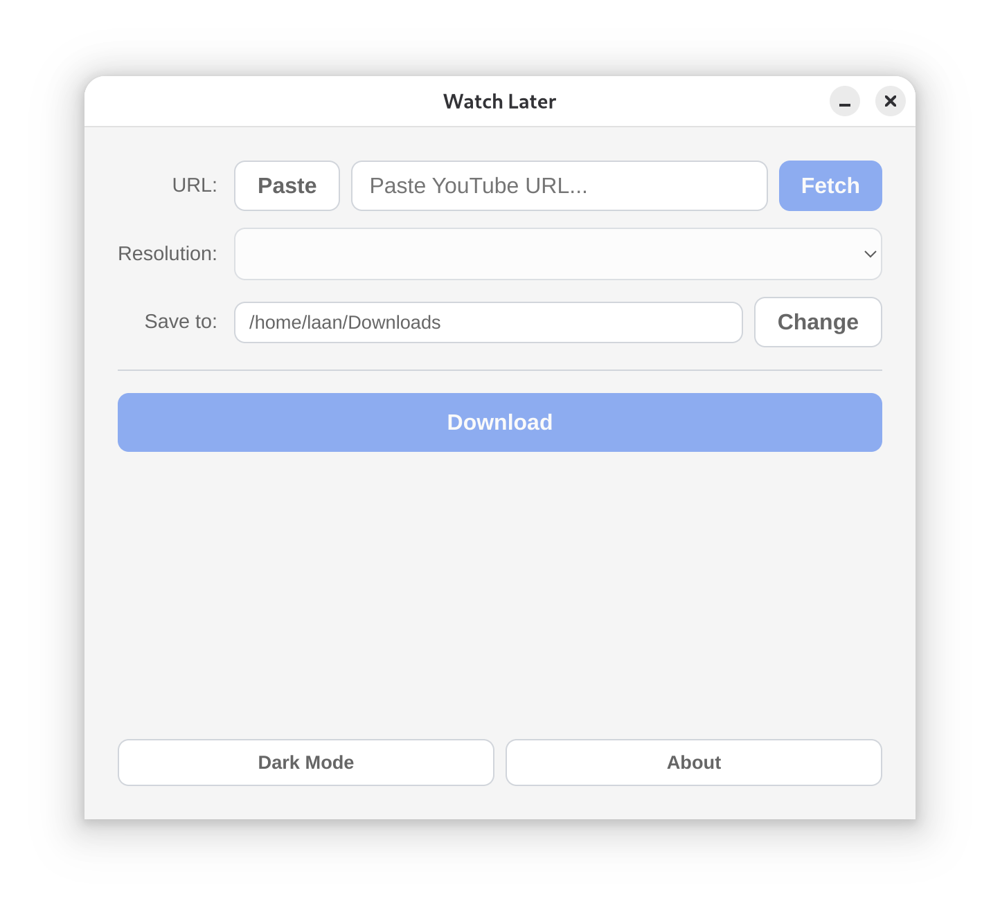

# Watch-Later

Watch-Later is a desktop tool built with Electron and Svelte, designed to download YouTube videos in MP4 format. The user interface is simple, with a URL input box, a Download button, and a progress bar while downloading and/or converting the video. The tool allows the user to select the resolution of the download, and defaults to the highest available resolution.




## Prerequisites

- [Node.js](https://nodejs.org/) v20 or later
- npm (comes with Node.js)

The yt-dlp binary is downloaded automatically on first launch. ffmpeg is bundled via the `ffmpeg-static` package.

## Dev Environment Setup

1. Install dependencies.
2. Build the app, without packaging.
2. Start the app in development mode (hot-reload enabled)

```bash
npm install
npm run build
npm run preview
npm run dev
```

## Packaging

Build a distributable package for your platform:

```bash
# Linux (AppImage)
npm run build:linux

# macOS (DMG)
npm run build:mac

# Windows (NSIS installer)
npm run build:win

# Unpacked directory (useful for testing)
npm run build:unpack
```

Packaged output is written to the `dist/` directory.

## Tech Stack

- **Electron** -- desktop shell
- **Svelte 5** -- UI framework
- **electron-vite** -- build tooling (Vite-based)
- **yt-dlp** (via `yt-dlp-wrap`) -- YouTube video downloads
- **ffmpeg** (via `ffmpeg-static`) -- video/audio merging
- **electron-builder** -- packaging
